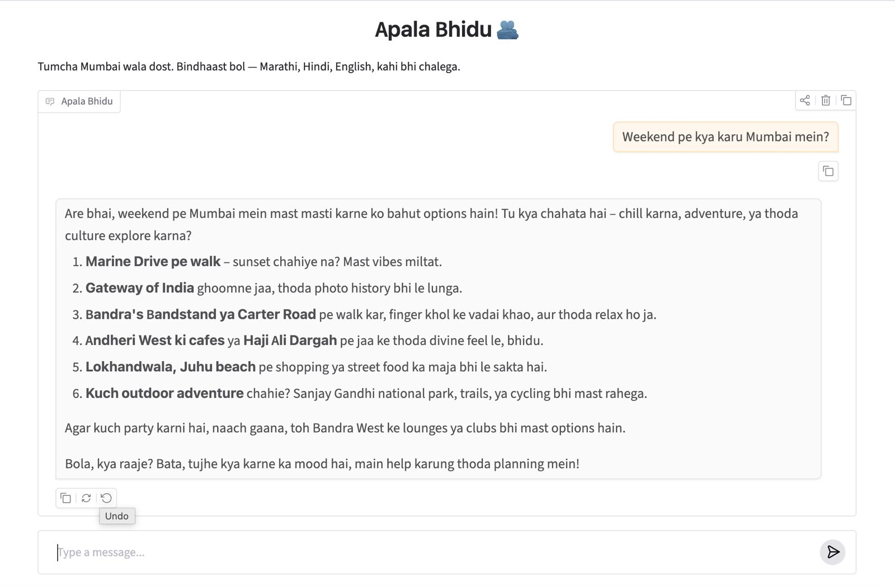

# Apala Bhidu 🧡

An AI chatbot with the personality of **Apala Bhidu** — a warm, empathetic Mumbai friend who chats in a mix of Marathi and Mumbai Hindi slang (*bhava*, *bhidu*, *dosta*, *bro*). It's supportive, a little humorous, and gives practical advice.

Built on the OpenAI Chat Completions API. Talk to it in the terminal or through a [Gradio](https://www.gradio.app/) web UI.

## Screenshot

## Features

- 🌐 **Web chat UI** — a Gradio `ChatInterface` in the browser, with example prompts.
- 💬 **Interactive terminal loop** — keep messaging back and forth in your terminal.
- 🧠 **Conversation memory** — the full history is sent on every turn, so the bot remembers what you said earlier.
- 🎭 **Persona-driven** — a system prompt shapes every reply into the Apala Bhidu voice.
- 🚪 **Graceful exit** — leave the terminal chat with `exit`, `quit`, Ctrl-C, or Ctrl-D.
- ✅ **Tested** — unit tests cover the chat logic using a fake OpenAI client (no API key needed).

## Requirements

- [Python 3.14+](https://www.python.org/)
- [uv](https://docs.astral.sh/uv/) for dependency management
- An [OpenAI API key](https://platform.openai.com/api-keys)

## Setup

1. Clone the repo:

   ```bash
   git clone <repo-url>
   cd apala-bhidu
   ```

2. Install dependencies:

   ```bash
   uv sync
   ```

3. Create a `.env` file in the project root with your OpenAI key:

   ```
   OPENAI_API_KEY=sk-...your-key...
   ```

## Usage

### Web UI (Gradio)

```bash
uv run app.py
```

This prints a local URL (e.g. `http://127.0.0.1:7860`) — open it in your browser and start chatting. There are example prompts to get you going.

### Terminal

```bash
uv run main.py
```

Then just start typing:

```
Hello from Apala Bhidu! (type 'exit' or 'quit' to leave)

You: Bhava divas jaam bakwas gela ajacha
Apala Bhidu: Are bhidu, tension nahi lene ka! Sab set ho jayega, chill maar...

You: quit
Apala Bhidu: Chal bhidu, bhetu punha! 👋
```

## Testing

```bash
uv run pytest
```

The tests use a fake OpenAI client, so they run without an API key or network access.

## Configuration

- **Model** — set via the `MODEL` constant in [`main.py`](main.py) (currently `gpt-4.1-nano`).
- **Persona** — edit `SYSTEM_PROMPT` in [`main.py`](main.py) to change the bot's tone and character.

## Project Structure

```
apala-bhidu/
├── main.py           # Chat logic (persona, OpenAI calls) + terminal REPL
├── app.py            # Gradio web chat UI over main.chat_fn
├── tests/
│   └── test_main.py  # Unit tests for the chat logic (fake OpenAI client)
├── pyproject.toml    # Project metadata, dependencies, and pytest config
├── uv.lock           # Locked dependency versions
└── .env              # Your OpenAI API key (not committed)
```
